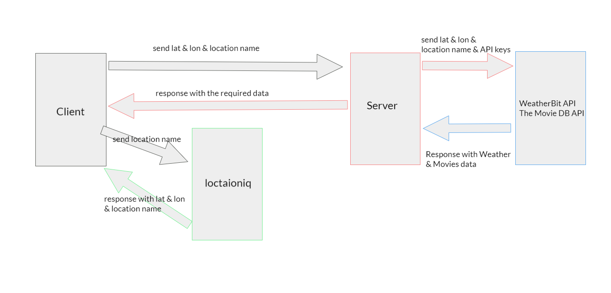

# city-explorer-api

**Author**: Mahmoud Saadeh
**Version**: 1.1.0

## Overview

this is the server side of this repo [city-explorer](https://github.com/Mahmoud-Saadeh/city-explorer), what this do is to add a weather and movies features for the website.
when the user enter the city name a request with the name will be sent and then give us a response with the weathers data and the movies data.

## Request and Response

## Getting Started

only write a valid city in the input field and get the weather and the movies info.

## Architecture

for the design, I only used Bootstrap library and some CSS.

## Change Log

24-5-2021 6:00pm - Application now has a weather feature.
26-5-2021 7:30pm - Application now has a Movies feature.

## Credit and Collaborations

[Node](https://nodejs.org/)
[Express](https://expressjs.com/)
[Cors](https://www.npmjs.com/package/cors)
[WeatherBit API](https://www.weatherbit.io/api)
[The Movie DB API Docs](https://developers.themoviedb.org/3/getting-started/introduction)

## Name of feature: Weather

Estimate of time needed to complete: 1.5 hours

Actual time needed to complete: 2:15 hours.

## Name of feature: Movies

Estimate of time needed to complete: 1 hours

Actual time needed to complete: 1:30 hours.
