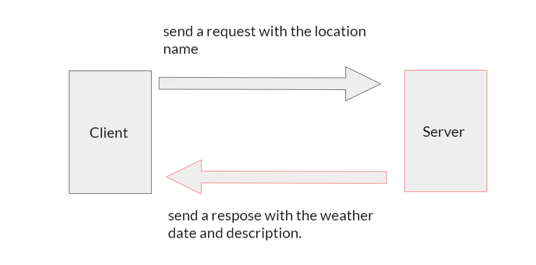

# city-explorer-api

**Author**: Mahmoud Saadeh
**Version**: 1.0.0 

## Overview
this is the server side of this repo [city-explorer](https://github.com/Mahmoud-Saadeh/city-explorer), what this do is to add a weather feature for the website.
when the user enter the city name a request with the name will be sent and then give us a response with the date and the weather description.

## Request and Response

## Getting Started
only write a valid city in the input field and to get the weather info. the location name must be Amman, Paris or Seattle.

## Architecture
for the design, I only used Bootstrap library and some CSS.

## Change Log

24-5-2021 6:00pm - Application now has a weather feature.

## Credit and Collaborations
[Node](https://nodejs.org/)
[Express](https://expressjs.com/)
[Cors](https://www.npmjs.com/package/cors)

Name of feature: Weather

Estimate of time needed to complete: 1.5 hours

Actual time needed to complete: 2:15 hours.